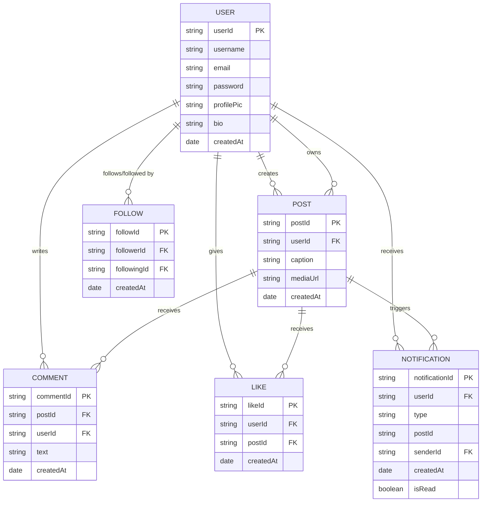

```mermaid
erDiagram
    USER {
        string userId PK
        string username
        string email
        string password
        string profilePic
        string bio
        date createdAt
    }
    POST {
        string postId PK
        string userId FK
        string caption
        string mediaUrl
        date createdAt
    }
    COMMENT {
        string commentId PK
        string postId FK
        string userId FK
        string text
        date createdAt
    }
    LIKE {
        string likeId PK
        string userId FK
        string postId FK
        date createdAt
    }
    NOTIFICATION {
        string notificationId PK
        string userId FK
        string type
        string postId
        string senderId FK
        date createdAt
        boolean isRead
    }
    FOLLOW {
        string followId PK
        string followerId FK
        string followingId FK
        date createdAt
    }

    USER ||--o{ POST : creates
    USER ||--o{ COMMENT : writes
    POST ||--o{ COMMENT : receives
    USER ||--o{ LIKE : gives
    POST ||--o{ LIKE : receives
    USER ||--o{ NOTIFICATION : receives
    USER ||--o{ FOLLOW : "follows/followed by"
    POST ||--o{ NOTIFICATION : "triggers"
    USER ||--o{ POST : "owns"
```
